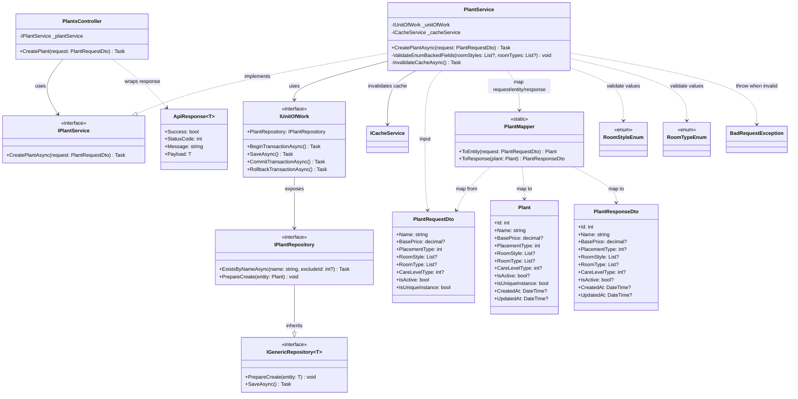

# Class Diagram - Create master data plant

## Sequence note for create flow

1. PlantsController.CreatePlant nhận PlantRequestDto.
2. PlantService.CreatePlantAsync mở transaction qua IUnitOfWork.
3. Service gọi IPlantRepository.ExistsByNameAsync để chống trùng tên.
4. Service validate RoomStyle và RoomType theo enum.
5. PlantMapper.ToEntity chuyển PlantRequestDto thành Plant.
6. Service gọi IPlantRepository.PrepareCreate rồi IUnitOfWork.SaveAsync.
7. Service commit transaction, invalidate cache, map PlantResponseDto và trả về.
